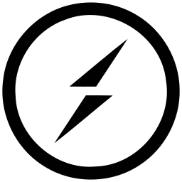

# Hi, I am Houman👋

 
    
    

 
I am a fresh polytechnic IT graduate and I will be matriculating into CS @ National University of Singapore at 2024. I enjoy software development and I do random side projects related to full stack development and mobile application development. Currently, I am aiming to improve my skills on writing more optimised and performant code.

## Languages & Technologies

  
&nbsp;

&nbsp;

&nbsp;

&nbsp;

&nbsp;

&nbsp;

&nbsp;

&nbsp;

&nbsp;

&nbsp;

&nbsp;

&nbsp;

&nbsp;

&nbsp;

&nbsp;

&nbsp;

&nbsp;

&nbsp;

&nbsp;

&nbsp;

&nbsp;

## Connect with me

- [hwendev.com](https://www.hwendev.com/), my personal site! 😄
- [LinkedIn](https://linkedin.com/in/hwendev), and connect with me! 💼
- [Leetcode](https://leetcode.com/hwennn/), let's grind Leetcode together :D 🚀

 

📊 &nbsp;**This week I spent my time on**

  
<b>📈&nbsp;Random stats</b>

   

